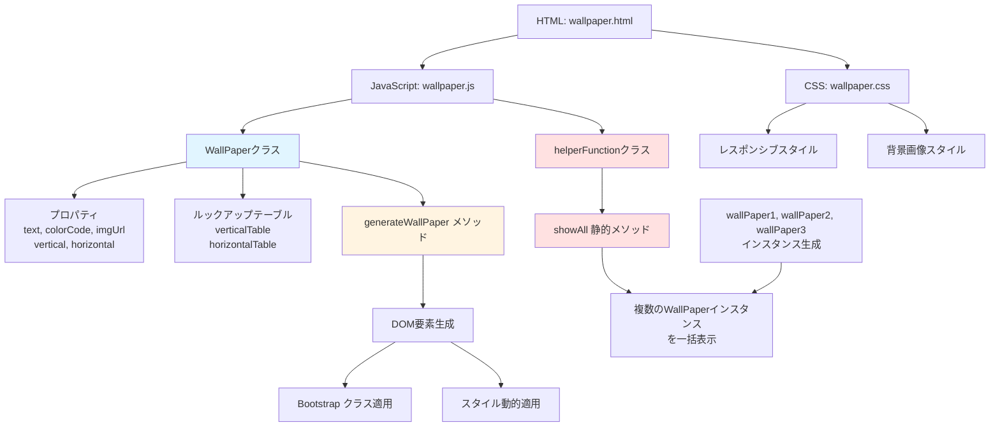
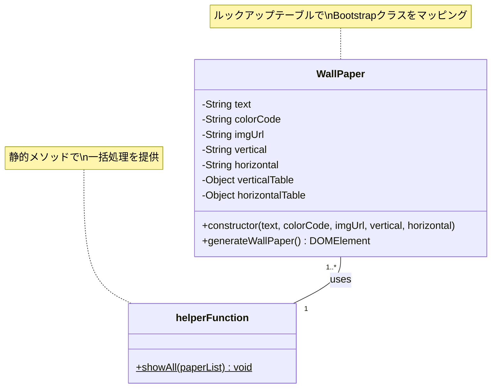

# Motivational Speech Wallpaper

## 概要

Motivational Speech Wallpaperは、モチベーションを高める名言を美しい背景画像と共に表示するWebアプリケーションです。エンジニアや科学者の名言を配置した壁紙風のカードを生成し、ユーザーに日々のインスピレーションを提供します。

## 特徴

- **シンプルで美しいUI**: Bootstrap 4を使用したレスポンシブデザイン
- **カスタマイズ可能な表示**: テキストの位置(縦・横)、色、背景画像を自由に設定可能
- **オブジェクト指向設計**: JavaScriptのクラスベース設計による拡張性の高い構造
- **レスポンシブ対応**: モバイルからデスクトップまで、あらゆるデバイスで最適表示
- **外部依存なし**: CDNを使用しているため、ローカルサーバーで即座に動作

## このプロジェクトを通して学べること・習得できること

### 1. オブジェクト指向プログラミング(OOP)の実践

- **クラス設計**: `WallPaper`クラスを通じて、プロパティとメソッドのカプセル化を学習
- **コンストラクタパターン**: 複数のパラメータを受け取るコンストラクタの実装方法
- **静的メソッド**: `helperFunction`クラスの`showAll`メソッドで静的メソッドの活用方法を理解

```javascript
class WallPaper {
    constructor(text, colorCode, imgUrl, vertical, horizontal) {
        // カプセル化の実践
    }
}
```

### 2. データ構造とルックアップテーブルの活用

- **ルックアップテーブル**: `verticalTable`と`horizontalTable`を使用した効率的なクラス名マッピング
- **O(1)の検索時間**: オブジェクトをハッシュマップとして使用し、高速な値の取得を実現

```javascript
verticalTable = {
    "top": "align-items-start", 
    "center": "align-items-center", 
    "bottom": "align-items-end"
}
```

### 3. DOM操作とJavaScript

- **動的要素生成**: `createElement`と`innerHTML`を使用した動的なHTML生成
- **テンプレートリテラル**: バッククォートを使用した複雑なHTMLテンプレートの構築
- **DOM API**: `getElementById`、`append`、`classList`などのネイティブAPIの活用

### 4. CSSフレームワークの理解

- **Bootstrap 4**: ユーティリティクラス(`d-flex`、`justify-content-*`、`align-items-*`)の実践的な使用
- **Flexboxレイアウト**: フレキシブルボックスモデルによる要素の配置とアライメント
- **レスポンシブデザイン**: `col-md-8`、`col-12`などのグリッドシステムの活用

### 5. デザインパターン

- **Factory Pattern**: `WallPaper`クラスによる一貫したオブジェクト生成
- **Helper/Utility Pattern**: `helperFunction`クラスによる共通処理の集約
- **Template Method Pattern**: `generateWallPaper`メソッドでのHTMLテンプレート生成

### 6. CSS設計とレスポンシブデザイン

- **メディアクエリ**: 画面サイズに応じたスタイル変更(`@media (min-width: 992px)`)
- **カスタムプロパティ**: `.vh-75`などのユーティリティクラスの作成
- **背景画像の制御**: `background-size: cover`と`background-repeat: no-repeat`の適切な使用

### 7. ソフトウェアアーキテクチャの基礎

以下のMermaid図は、本プロジェクトのアーキテクチャと処理フローを示しています。





### 8. Web標準技術の理解

- **HTML5**: セマンティックなマークアップとメタタグの適切な使用
- **CSS3**: モダンなCSSプロパティとベストプラクティス
- **ES6+**: クラス構文、テンプレートリテラル、アロー関数、let/constの使用

### 9. コードの保守性と拡張性

- **関心の分離**: HTML、CSS、JavaScriptの明確な役割分担
- **スケーラビリティ**: 配列とループを使用した複数要素の効率的な処理
- **再利用性**: クラスベース設計による新しいインスタンスの簡単な追加

## 必要条件

- モダンなWebブラウザ(Chrome、Firefox、Safari、Edgeなど)
- インターネット接続(Bootstrap CDNとFont Awesome CDNを使用するため)

## インストール手順

1. リポジトリをクローンします:
```bash
git clone <repository-url>
cd MotivationalSpeechWallpaper
```

2. 依存関係のインストールは不要です(CDNを使用)

3. wallpaper.htmlをWebブラウザで開きます:
```bash
# macOSの場合
open wallpaper.html

# Windowsの場合
start wallpaper.html

# Linuxの場合
xdg-open wallpaper.html
```

## 使用方法

### 基本的な使い方

1. wallpaper.htmlをブラウザで開くと、3つの名言カードが表示されます
2. 各カードは異なる配置と背景を持っています

### 新しい壁紙の追加

wallpaper.jsに新しい`WallPaper`インスタンスを追加します:

```javascript
// 新しいインスタンスの作成
let wallPaper4 = new WallPaper(
    "Your motivational quote here",
    "FF5733",  // カラーコード(#なし)
    "https://example.com/image.jpg",  // 背景画像URL
    "center",  // 縦位置: "top", "center", "bottom"
    "right"    // 横位置: "left", "center", "right"
);

// wallPaperListに追加
let wallPaperList = [wallPaper1, wallPaper2, wallPaper3, wallPaper4];
```

### パラメータの説明

- `text`: 表示するテキスト
- `colorCode`: テキストの色(16進数カラーコード、#なし)
- `imgUrl`: 背景画像のURL
- `vertical`: 縦方向の位置(`"top"`, `"center"`, `"bottom"`)
- `horizontal`: 横方向の位置(`"left"`, `"center"`, `"right"`)

## 機能一覧

- ✅ 名言テキストの表示
- ✅ カスタム背景画像の設定
- ✅ テキストカラーのカスタマイズ
- ✅ テキスト位置の柔軟な配置(9方向)
- ✅ レスポンシブデザイン対応
- ✅ 複数の壁紙を一度に表示
- ✅ モバイルフレンドリーなUI

## 技術スタック

### フロントエンド
- **HTML5**: 構造とマークアップ
- **CSS3**: スタイリングとレスポンシブデザイン
- **JavaScript (ES6+)**: ロジックとDOM操作

### フレームワーク・ライブラリ
- **Bootstrap 4.1.3**: UIコンポーネントとグリッドシステム
- **Font Awesome 6.1.2**: アイコンフォント

### 開発ツール
- テキストエディタ/IDE(Visual Studio Code推奨)

### 使用画像
- Pixabay(フリー画像素材)

## プロジェクト構造

```
MotivationalSpeechWallpaper/
├── wallpaper.html    # メインHTMLファイル
├── wallpaper.css     # カスタムスタイルシート
└── wallpaper.js      # JavaScriptロジック
```

## 追加資料

### クラス構造図

上記の「このプロジェクトを通して学べること・習得できること」セクションのMermaid図を参照してください。

### コードフロー

1. wallpaper.htmlが読み込まれる
2. wallpaper.jsが実行される
3. `WallPaper`インスタンスが生成される
4. `helperFunction.showAll()`が呼び出される
5. 各インスタンスの`generateWallPaper()`が実行される
6. DOMに要素が追加される
7. wallpaper.cssがスタイルを適用する

## 貢献方法

プロジェクトへの貢献を歓迎します!以下の方法で貢献できます:

### バグ報告
1. GitHubのIssuesセクションで新しいIssueを作成
2. バグの詳細な説明と再現手順を記載
3. 可能であればスクリーンショットを添付

### 新機能の提案
1. Issuesで機能提案を作成
2. 提案の目的と期待される効果を説明
3. コミュニティのフィードバックを待つ

### Pull Requestの送信
1. リポジトリをフォーク
2. 新しいブランチを作成 (`git checkout -b feature/amazing-feature`)
3. 変更をコミット (`git commit -m 'Add some amazing feature'`)
4. ブランチにプッシュ (`git push origin feature/amazing-feature`)
5. Pull Requestを作成

### コーディング規約
- ES6+の構文を使用
- インデントは2スペース
- わかりやすい変数名とコメントを記載
- 既存のコードスタイルに従う

## ライセンス

このプロジェクトはMITライセンスの下で公開されています。詳細は`LICENSE`ファイルを参照してください。

---

## 参考情報

### 使用している名言の出典
- Antoine de Saint-Exupéry(『星の王子さま』著者)
- Gordon Lindsay Glegg(機械工学者)
- Theodore von Karman(航空工学者)

### 関連リンク
- [Bootstrap 4 Documentation](https://getbootstrap.com/docs/4.1/)
- [Font Awesome Icons](https://fontawesome.com/)
- [Pixabay](https://pixabay.com/)

## お問い合わせ

質問や提案がある場合は、GitHubのIssuesセクションでお気軽にお問い合わせください。